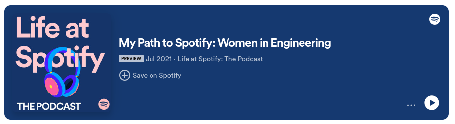
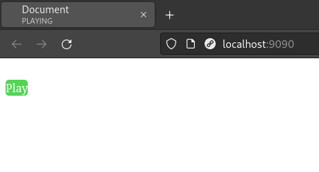

# SpotifyEmbedPlayButtonOnly
Simple poc of using the spotify iframe to display only a play button and no further song details

https://developer.spotify.com/documentation/embeds/references/iframe-api

Spotify allows you to embed songs in iframes like this. But it comes with a lot of bloat such as the song title, image and some other styling you might not want or want to change.

So this simple proof of concept only extracts the play button which now can be fully customized. The play button is then still playing a song served by spotify.

